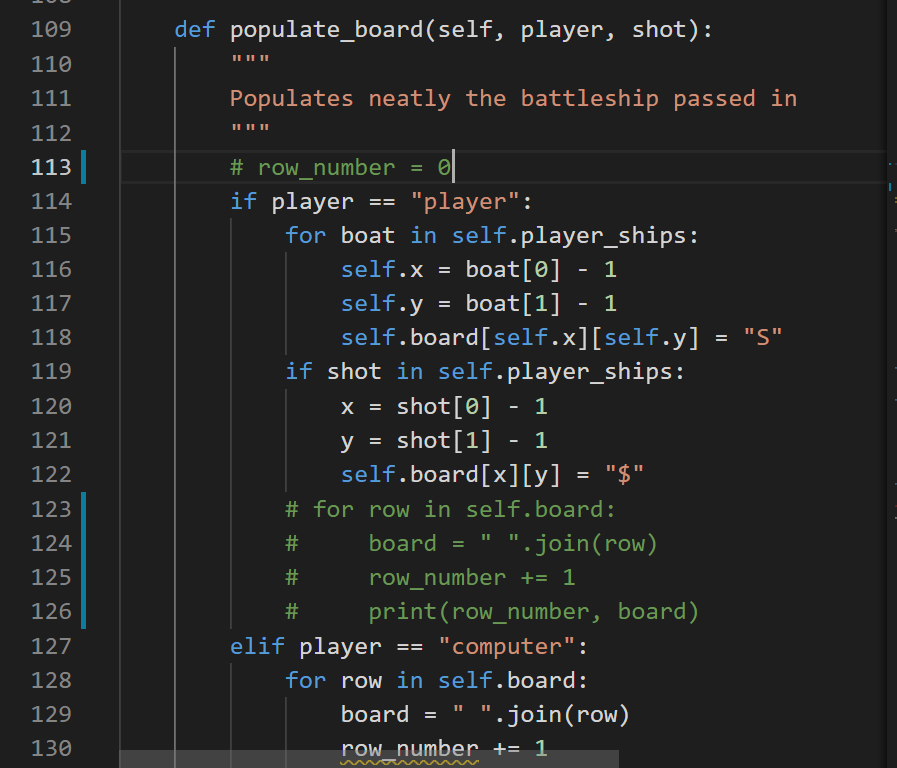
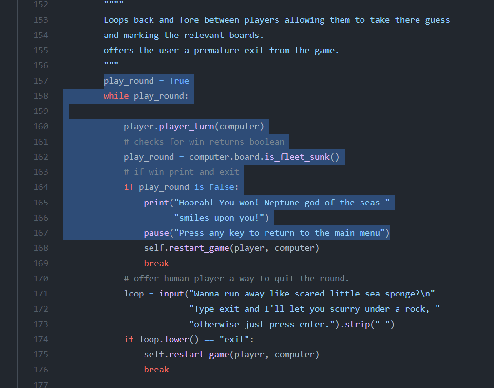

# Overview

This is a very simple computized version of the very popular Battleship game board launched in 1931, in wich one player needs to find and shink the opponent's boats to win the game.

See [Wikipedia](<https://en.wikipedia.org/wiki/Battleship_(game)>)

The game is only run into the terminal and utilises the Code Institue template which makes possible to run the game in the browser.

## How to play

* The number of ships is standard, and the ships will be placed randomly.
* The user must enter row and column as a shot target.
* The radar will show one of the above symbols in response to the user's guess.
* Coputer guesses will also be displayed.
* The game will finish when one of the players gets to shink all of the opponent's boats.

**Game Leyend**

 - **S** stands for boat
 - **$** stands for hit boat
 - **X** stands for missed shot

* Go to live vesion [Battleship](<https://battleship-py-cod-ins-prj-3.herokuapp.com/>)

# Table Contents

### [Planning stage](#planning-stage)

- Target audiences
- User stories
- Flow Chart

### [Features](#features)

- Player's name
- Narrative
- Board size
- Ships
- Shots
- Validation

### [Future features](#future-features)

### [Testing](#testing)

- Manual testing
- Light House
- VS Debugger
- Validators

### [Technology Used](#technology-used)

- Languajes
- Libraries

### [Bugs](#bugs)

- Fixed bugs
- Known bugs

### [Credits](#credits)

- Content
- Acknowledgements

# Planing stage

## Target audience

 Anyone looking for a strategy game to have fun on their own for a little while, by it at home, bus, metro, etc, since it is playable on any device.

 ## User stories

 - As a user i want a clear and straightforward game instructions.

 - As a user i want an easy and simple online game to start and finish it quickly.

 - As a user a want it to be challenging.

 - As a user i want it to be visually attractive.

## Flow Chart

This is a simple flow chart of the game flow to scheme the steps needed to develop it

I used free app [draw.io](<https://app.diagrams.net/>)

## Features

At this point the game is limited in features due to its simplicity. 

- Player's name:

 The user must enter a player name which will be use later in the narrative and shown to indicate their game board.

.png)

 - Narrative:

 To improve the UX and inmerse the user into the game, a fun and a short narrative will be introduced from the very start all along till the very end of the game.

.png)

 - Size: 

The game board size is set to 5x5, with no chance for the user to pick at their choice.

.png)

 - Ships:

 At this point the number of ships for both players must vary due to code issues, one player may have more ships than the other, which makes it a bit more interserting, these ships are of a single cell length.

.png)

 - Shots:

 The user is allow to take their guess manually.

.png)

 - Validation:

   * Player's name.

    1- Firts input will have a minimun of 3 characters, and a maximun of 6.

    2- Second input will have a minimun of 4 characters, and a

    * Player's guess.

    Player is only allowed to enter and integer name from 1 to 5 to make their guess

    * Restart game.

    Once the game is finished, the player is able to restart the game without facing the intro game again, adn for that must enter "y/n", only one of these characters are possible.

 ## Future features

 Many features could added to improve the user's experience:

 * Let user pick board size
 * Set the same number of ships for both players
 * Let the user position boats on their board
 * Let user pick game difficulty by reducing the number of boats or/and implementing a    limited number of shots available, also by limitating the time avaiblable to finish the  game.
 * Add visual experience with a nice interface
 * Make it multiplayer

 ## Testing

 - Manual testing

 When developing i used manual testing by printing out the code so very often to check whether if the code was working as wanted. 

- Validation

Any input entered by the user is validated against certain pass criteria. I have checked its functionallity by entering many diferent inputs many times trying to break the code, i found a leak when entering user's guess and fixed.(see on bugs fixed section bellow)

 - VS Debugger

 I used a extension of Visual Studio named Jupiter, which i still don't know how to fully use it...
 The debugger tool tells you all the error while coding like extra whitespaces, code lines way to long.
 It also allows you to debugg using breakpoints, which i still don't understand, sometimes it shows an error but the terminal runs perfectly...

 - Validators

   - HTML [W3C](<https://validator.w3.org/>)

    It shows errors and warnings on the index.html file provided by Code Institute Template.

  

   - Python [PEP8](>http://pep8online.com/>)

    All py files showed no errors or warnings

  ## Technology Used

  - Languajes
   
    - HTML
    - JavaScript
    - Python

  - Libraries

   - No libraries were used on this project

## Bugs

On this project i faced problems and challenges on every single method as new to Python and classes which i still need to work on to understand them. 

I tried to write down all the problems i faced while developing, and takin images of them so i could explain them on this section.

Now i go through all of them on my notebook and they don't make any sense...i don't even remember them... so here only the ones that make sense :)

 **Fixed bugs**

 * **Bug**

    When creating a board i wanted to show numbers on every row as landmarks for the user. The approched i took was **see 1st image**, but when printing the board with ships or shots nor these or the row numbers were shown.
    
    **Fix**

    From one of the resourses metioned bellow(see Code Credits) i took the next approach. Initialize a count outside the if statement, and increases along depending of the numbers of rows in th board **see commented code on the 2nd image** 

* **Bug**

    When printing out the radar, i tried to print it after updating the board with the user's shots but i kept getting the initial empty board.
  
  **Fix**
    It took me a while to figure out 

* **Bug**

    In order to finish the game i kwnew that a while loop was need and somehow break it with a False boolean.

  **Fix**

    I didn't know how to approach this and after hours of trial and error, i looked this guy's code **see 1st image** and learnt his approach by usuing the if statement in the while loop to cheack whether a condition is true or false.
    Then i created a count to keep track of the remainding boats and a game over function **see 2nd image** to return false if the condition is true.

* **Bug**

    The biggest problem i faced was populating the player's board updated whit hit boats using "$" symbol. I spent over 12 hours there...

  **Fix**

    In this case the method i called by the player instance and passes in the player's name as string and the last shot of the other's player. 
    **(see image code block 124/127)**.

   1. I loop through the boats in the player's ships list, get the coordenates of each one and place an "S" symbol on the player's board.

   .png)

   2. Only after that i could update the boats status, and for that i take the opponent's last shot and check it against player's ships array, get the shot cordenates and update the player's board with "$" symbol

   .png)

   3. Print board neatly and updated.

   .png)

* **Bug**

    The user's guess input validation would throw all the errors stored after few a failure attemps and the code woul break.

  **Fix**

    The loop kept runnig till the input was valid but afetr a few attempts it would crashed and throw all the errors stored. The variable's value input kept storing the data over and over while loop run, which made crash. I fixed by giving the variable a empty string at the top of the loop.

 **Unfixed bugs**

   * Boats duplicated.

   Players might have different number of boats for each player down to a replication of boats.

   After having my last facetime session with my mentor, i realized that my random ships method also creates duplicates boats... so could not go through it with him, and that was only 2 days before the submit project deathline. 
   I tried hard to fix it but i was burning off time and had to keep going, from this attempt of fixing it i found a way to keep track of the actual number of boats in every list.
   I convert the list in sets, and gice the length of the set to a global variable.

 .png)

## Credits

- Code

At first i didn't even know how to code this project, and only after watching the **Code Institute demo**, i could start following that approach.
It is relly helpfull fro unexperienced peope like me!

Also i wathed some tutorials that helped me how to create a matrix(which is also covered on the python essentials module), how to update boards, and other many things.

* Object Oriented Battleship game

  - Part 1 (<https://youtu.be/xz9GrOwQ_5E>)
  - Part 2 (<https://youtu.be/CIv7lPZy9nQ>)
  - Part 3 (<https://youtu.be/jshgccgBs2U>)

* Functional Battleship game

  - (<https://youtu.be/7Ki_2gr0rsE>)

 ## Acknowledge

First and foremost, lots of thankst to [Richard Wells](https://github.com/D0nni387) my mentor from who i learn many things in every session and helped me through when i was stuck.

Thanks as well to Code Institute for providing that demo, as the Love Sandwitches code along project has nothing to do with building a project with OOP approach.

 